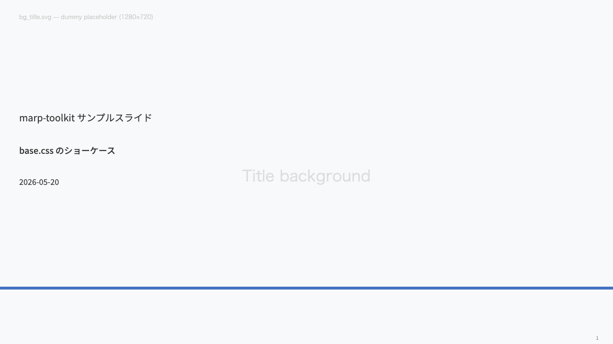
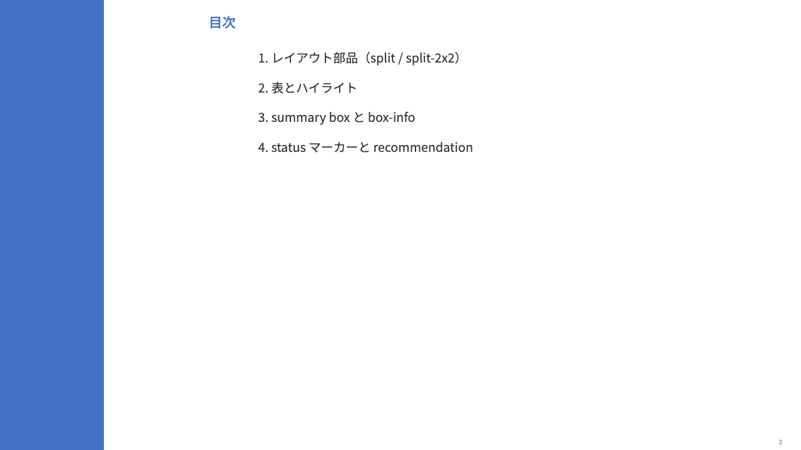
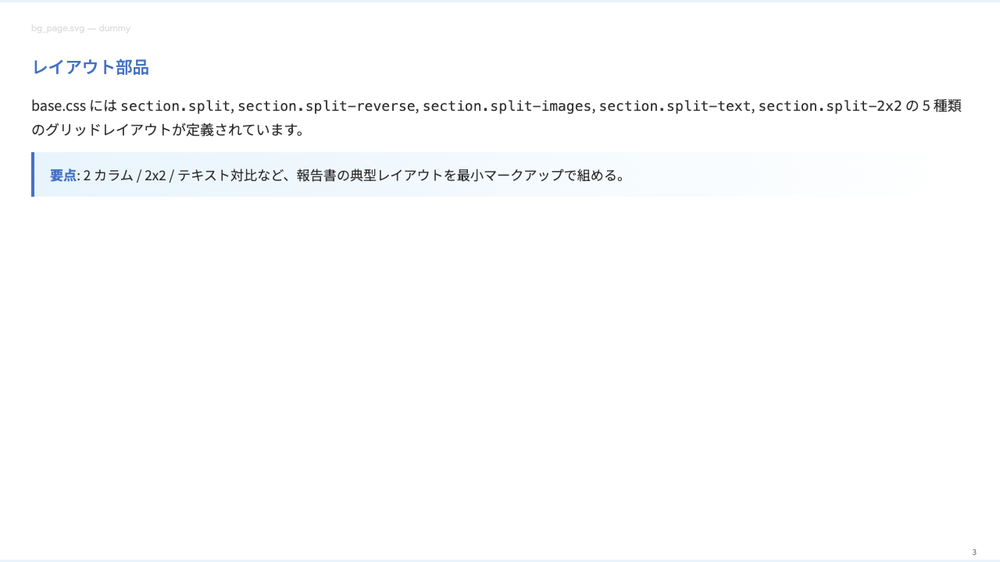
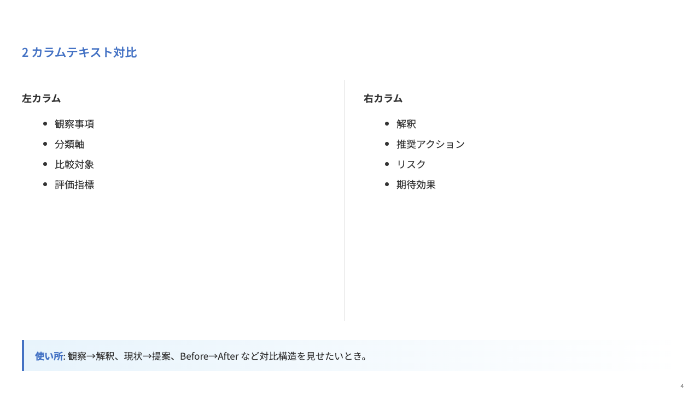
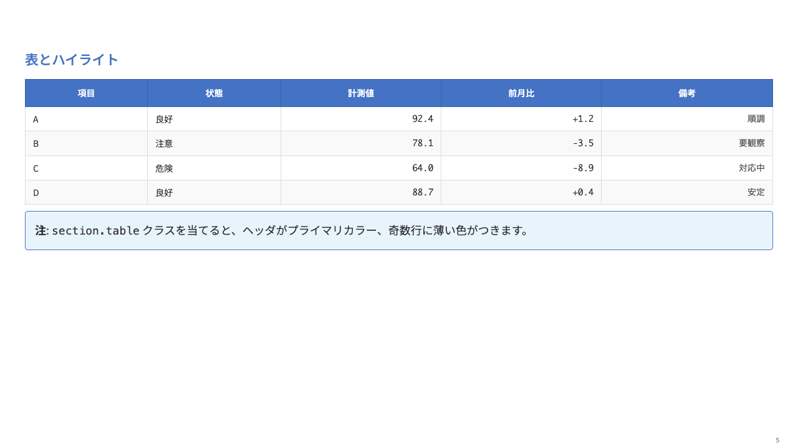
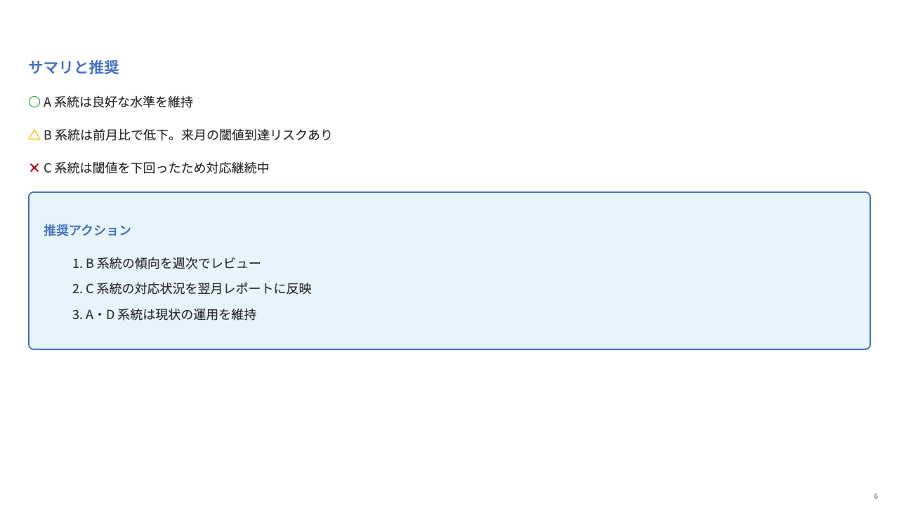

# marp-toolkit

Marp スライド作成のためのテーマ CSS と、AI 臭防止の知識ベースをまとめたツールキット。

- `themes/base.css` — 汎用青系テーマ。レイアウト部品（split, summary-box, table 等）とタイポグラフィを一通り含む完成テーマ
- `examples/sample.md` — `base.css` の主要機能を一通り使ったショーケース
- `anti-aiisms/` — AI が書いたスライドから「AI 臭」を抜くためのルーブリックとコーパスの運用方法

派生テーマ（自社ブランドカラーや背景画像を上乗せしたいケース）は、CSS には触らず Marp 標準の `![bg]` 構文で背景画像を当てる構成を推奨します。詳細は下の「背景画像の当て方」を参照。

## Preview

`examples/sample.md` を marp-cli でレンダリングした見た目です。

| Title | Index | Content (page + ![bg]) |
|---|---|---|
|  |  |  |

| Split text | Table | Summary | End |
|---|---|---|---|
|  |  |  |  |

生成コマンド: `bash examples/render-screenshots.sh`（中身は `marp examples/sample.md --images png --allow-local-files --theme-set themes/base.css -o examples/screenshots/sample.png`）

## 構成

```
marp-toolkit/
├── themes/
│   └── base.css                # 汎用テーマ（レイアウト + タイポグラフィ + プライマリカラー）
├── examples/
│   ├── sample.md               # base.css のショーケース
│   ├── assets/img/             # ![bg] 構文で使うダミー背景画像（SVG）
│   │   ├── bg_title.svg
│   │   ├── bg_index.svg
│   │   ├── bg_page.svg
│   │   └── bg_end.svg
│   └── screenshots/            # sample.md を marp-cli でレンダリングした PNG（README の Preview 用）
└── anti-aiisms/                # AI 臭防止の知識ベース
    ├── README.md
    ├── RUBRIC.md
    ├── CORPUS.md
    └── CHANGELOG.md
```

## クイックスタート（marp-cli）

```bash
git clone https://github.com/Maeno1/marp-toolkit.git
cd marp-toolkit
marp examples/sample.md --pdf --theme-set themes/base.css --allow-local-files
```

`examples/sample.md` をプレビューすれば、`base.css` のレイアウト部品と背景画像 (`![bg]`) の組み合わせ例が一通り確認できます。

## VS Code Marp Extension での使い方

### 1. プロジェクト直下に symlink を 1 本作る

```bash
cd <project-root>
ln -s <path-to-marp-toolkit>/themes marp/themes
```

### 2. `.vscode/settings.json`

```json
{
  "markdown.marp.themes": [
    "./marp/themes/base.css"
  ]
}
```

### 3. `.gitignore` に symlink を追加（マシン固有のためコミットしない）

```
marp/themes
```

### 4. スライドファイル frontmatter

```yaml
---
marp: true
theme: base
---
```

### 5. 初回は VS Code を Reload Window する

symlink 作成や `.vscode/settings.json` を変更した直後は、`Cmd+Shift+P` → `Developer: Reload Window` で VS Code Marp Extension に再認識させる必要があります。

## 背景画像の当て方

背景画像は **Marp 標準の `![bg]` 構文** で当てる方針です。テーマ CSS に `background-image: url(...)` を書かない設計のため、相対パス問題や VS Code Webview の `localResourceRoots` 制約に縛られず、利用者の md 配置階層にも非依存です。

### 基本パターン

```markdown
<!-- _class: title -->


# プレゼンタイトル
```

主要オプション:

| 構文 | 効果 |
|---|---|
| `` | スライド全面に背景 |
| `` | アスペクト比を保ったまま全面に拡大 |
| `` | 左 33% に縦帯として配置 |
| `` | 右半分に配置 |
| ` ` | 複数画像を縦並びで重ねる |

`examples/sample.md` の各ページで使用例を確認できます。

### 自社ブランドの画像で差し替える場合

`examples/assets/img/bg_*.svg` をブランド画像に差し替えるだけです。md 側の `![bg]` 構文はそのまま使えます。CSS 側を派生して `@theme my-brand` を作る必要はありません。

## CSS で `background-image: url()` を使いたい場合（参考）

`![bg]` 構文ではなく CSS 側で背景画像を持たせたい場合（クラス指定だけで自動的に背景がつく挙動が欲しい場合）は、以下の制約があります。

### VS Code Marp Extension の挙動

| リソース種別 | 読み込み主体 | symlink の扱い | workspace 外パス | データ URL |
|---|---|---|---|---|
| `markdown.marp.themes` の CSS 本体 | Extension が `fs.readFile()` で**テキスト**として読む | OS が透過解決 → OK | **NG**（公式仕様で workspace 内に限定） | — |
| CSS 内の `url(...)` 画像 | **Webview が個別リソースとして取得** | `localResourceRoots` チェックは **`realpath()` 解決を行わない** → symlink パスのまま判定して OK | NG | **NG**（Strict CSP が `img-src` から `data:` を除外。`Allow insecure local content` / `Disable` でも `localResourceRoots` の外は読まれない） |

**CSS 内 `url()` の base URI は CSS の場所ではなく、HTML（= .md ファイル）の場所**で解釈されます。これが共通テーマで「クラスごとに自動背景」を実現する際の最大のハマりポイントです。

### 試した代替策とそれぞれの結果

| 代替策 | 結果 | 備考 |
|---|---|---|
| CSS の `url()` をワークスペース外絶対パスに | NG | webview の `localResourceRoots` の外なので拒否。Markdown Preview Security の Disable でも CSP は緩むが `localResourceRoots` は変わらない |
| CSS の `url()` を **CSS 相対パス**（`../assets/img/...`）に | NG | `<style>` 埋め込み時の base URI は **HTML（.md）基準**なので、CSS 基準では解決されない |
| 画像を **base64 inline** で CSS に埋め込み | NG（VS Code Preview） | Strict CSP が `data:` を `img-src` から除外（inline `<style>` 経由でも同様）|
| 画像を symlink で workspace 内に持ち込み、url() を **md ファイル基準** で書く | OK | 採用構成。Reload Window が必須 |
| `markdown.marp.localResourceRoots` のような設定 | NG | **そんな設定は存在しない**（公式 `package.json` で確認済）|

### marp-team 公式が採っている解法

`marp-team/marp-core` は `postcss-url({ filter: '**/assets/**/*.svg', url: 'inline' })` を rollup ビルドに組み込み、配布 CSS では `url()` を **base64 データ URL に変換**しています。これにより配布物に外部 url() が残らず、`marp-cli` でも `localResourceRoots` 制約のないビルド済み CSS が動きます。

`marp-toolkit` は現状ビルドツールチェインを持たないため、この方式は採用していません。CSS-side で url() を扱いたい場合は、上記いずれかの仕組み（symlink 配置か postcss-url inline 化）を自前で用意してください。

## marp-cli でのエクスポート

VS Code Preview 経由ではなく `marp-cli` で PDF/HTML エクスポートする場合は、`localResourceRoots` の制約がないので絶対パスでも動きます:

```bash
marp <slide>.md --pdf --allow-local-files \
  --theme-set <path-to-marp-toolkit>/themes/base.css
```

> ⚠️ **`--theme-set` は必須**: frontmatter で `theme: base` を指定しても、Marp CLI は別途 `--theme-set` で base.css の path を渡さないと `base` というテーマを解決できません。指定がないと Marp Core 内蔵の default theme が fallback で当たり、レイアウト・色 (`#4472C4` 系)・フォントサイズ・grid 系クラス (`split-text` 等) が全て崩れます。VS Code Marp Extension は `markdown.marp.themes` 設定経由でテーマを認識するのでこの問題は起きません。CLI 経由のときだけ要注意です（同梱の `examples/render-screenshots.sh` は正しく組まれた呼び出しの参考例）。

## anti-aiisms について

`anti-aiisms/` ディレクトリは、AI が生成したスライドから「AI 臭」を抜くためのルーブリックと参照コーパスを管理する仕組みです。語彙ブラックリスト（「深掘り」「次アクション」など単語の置換）では追いきれない**文体・構造レベルの違和感**を、ルール（rubric）と実物の文体例（corpus）の 2 つで管理します。

詳細は [anti-aiisms/README.md](anti-aiisms/README.md) を参照してください。
