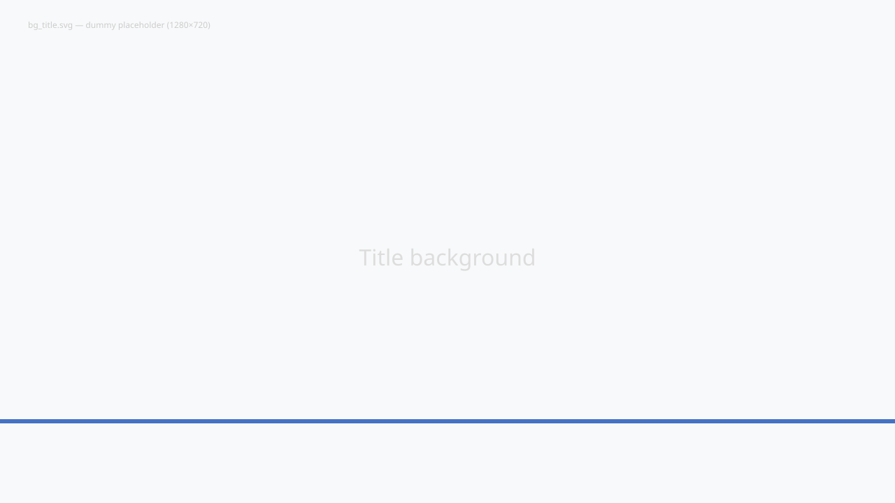

<!-- _class: title -->

# marp-toolkit サンプルスライド

## base.css のショーケース

**2026-05-20**

---

<!-- _class: index -->

# 目次

1. レイアウト部品（split / split-2x2）
2. 表とハイライト
3. summary box と box-info
4. status マーカーと recommendation

---

<!-- _class: page -->

# レイアウト部品

base.css には `section.split`, `section.split-reverse`, `section.split-images`, `section.split-text`, `section.split-2x2` の 5 種類のグリッドレイアウトが定義されています。

<strong>要点</strong>: 2 カラム / 2x2 / テキスト対比など、報告書の典型レイアウトを最小マークアップで組める。

---

<!-- _class: split-text -->

# 2 カラムテキスト対比

**左カラム**

- 観察事項
- 分類軸
- 比較対象
- 評価指標

**右カラム**

- 解釈
- 推奨アクション
- リスク
- 期待効果

<strong>使い所</strong>: 観察→解釈、現状→提案、Before→After など対比構造を見せたいとき。

---

<!-- _class: table -->

# 表とハイライト

| 項目 | 状態 | 計測値 | 前月比 | 備考 |
|---|---|---|---|---|
| A | 良好 | 92.4 | +1.2 | 順調 |
| B | 注意 | 78.1 | -3.5 | 要観察 |
| C | 危険 | 64.0 | -8.9 | 対応中 |
| D | 良好 | 88.7 | +0.4 | 安定 |

<strong>注</strong>: <code>section.table</code> クラスを当てると、ヘッダがプライマリカラー、奇数行に薄い色がつきます。

---

<!-- _class: summary -->

# サマリと推奨

A 系統は良好な水準を維持

B 系統は前月比で低下。来月の閾値到達リスクあり

C 系統は閾値を下回ったため対応継続中

### 推奨アクション

1. B 系統の傾向を週次でレビュー
2. C 系統の対応状況を翌月レポートに反映
3. A・D 系統は現状の運用を維持

---

<!-- _class: end -->

# Thank you
